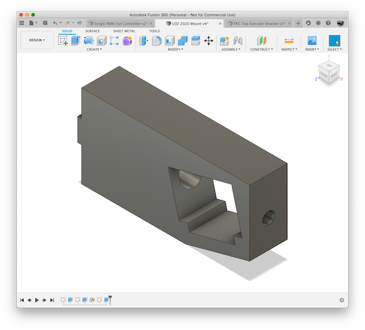
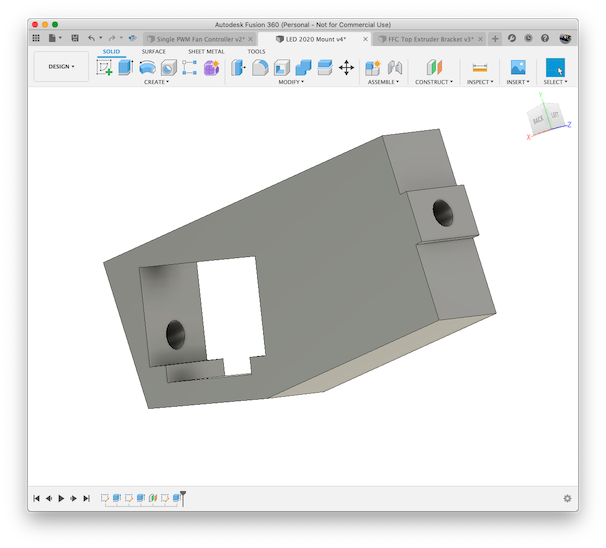

# LED Light Strip Mount for 2020 Extrusions

## What

A simple mount used to mount [this 12-24V 11.8" LED light strip](https://smile.amazon.com/gp/product/B00LAAUCZ2/)
to a 2020 extrusion.

## Print Instructions

Print two mounts per light bar.

## Required

* 1x LED Light Strip
* 2x M3 bolts 
* 2x 2020 t-nuts

## Images

