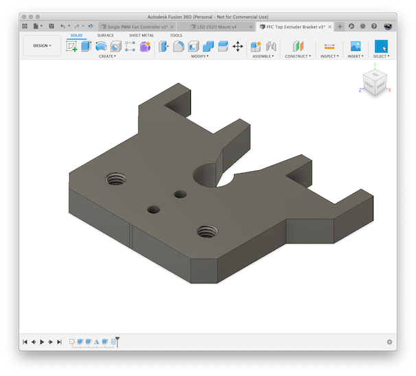
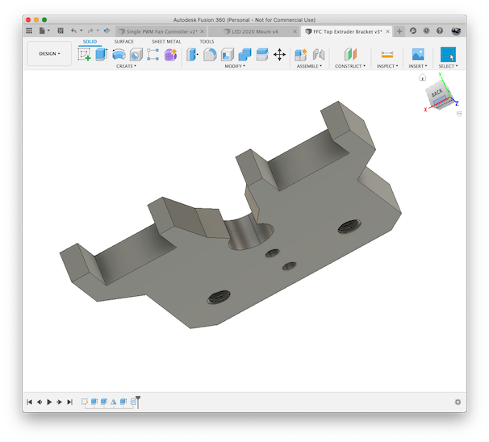

# Makerbot 2X / Flashforge Creator (Pro) Improved Bowden Mount

## What

On my Monoprice 2X printer (a rebranded Flashforge Creator X), the bowden
tubes going into the top of the extruder isn't very nice and occasionally 
would pop out.  And when I started printing with PLA, I wanted to print 
the filament from a dry box and needed to use a more standard size bowden
tube.

This mount replaces the existing mount and includes provisions for using
M6 bowden tube connectors.

## Print Instructions

If your printer is enclosed like mine is, then PLA isn't the best option
as the heat can cause the part to warp.  I originally printed mine using 
PETG, but ABS would work fine as well.

## Required

* 2x M6 bowdwn tube couplers

## Images

