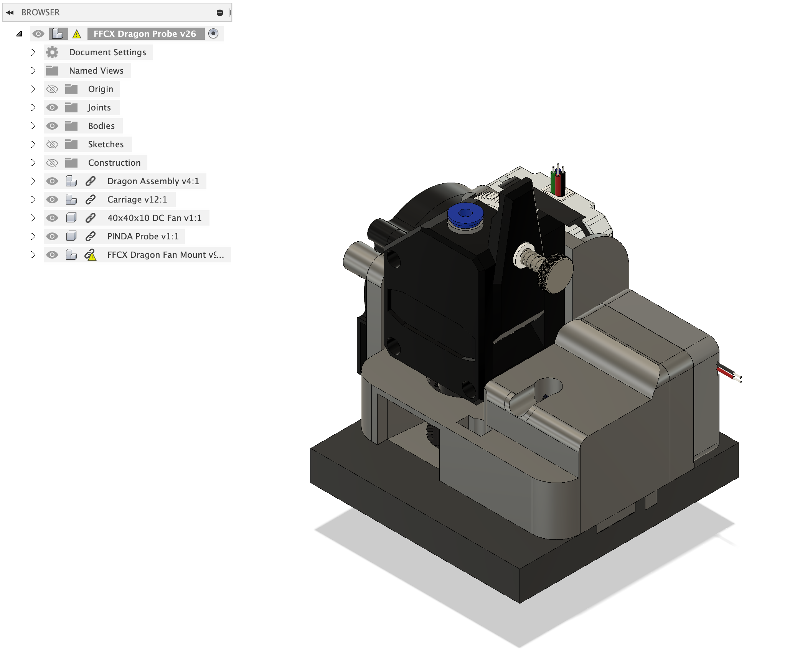
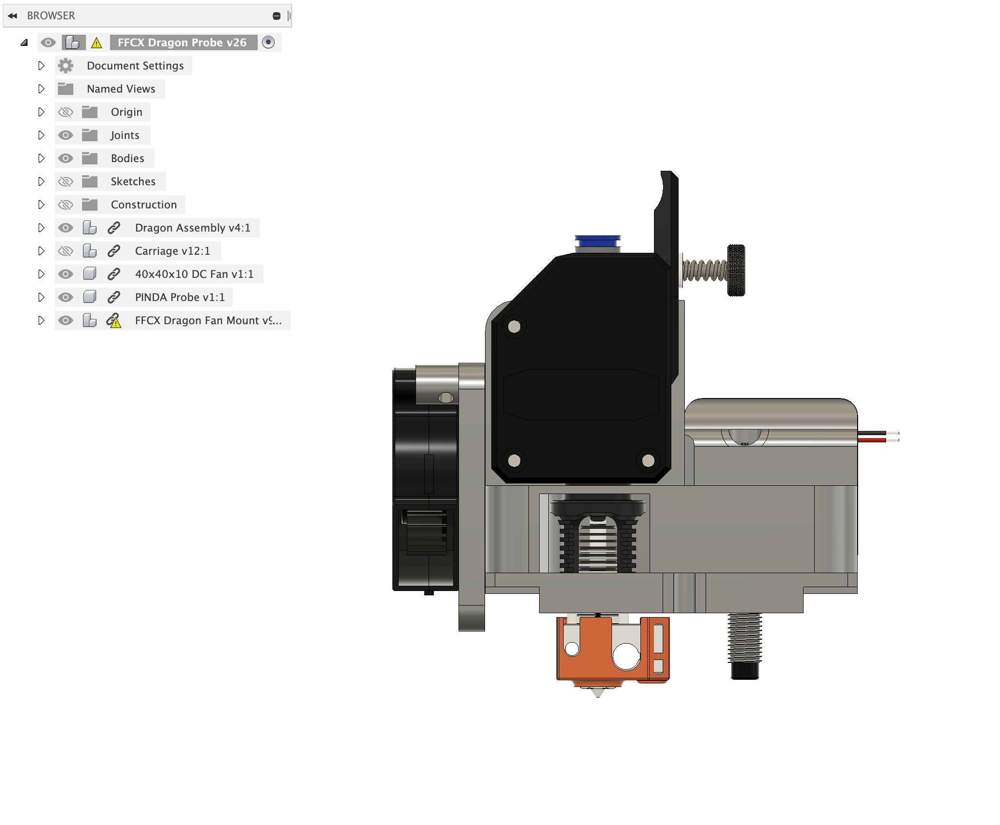
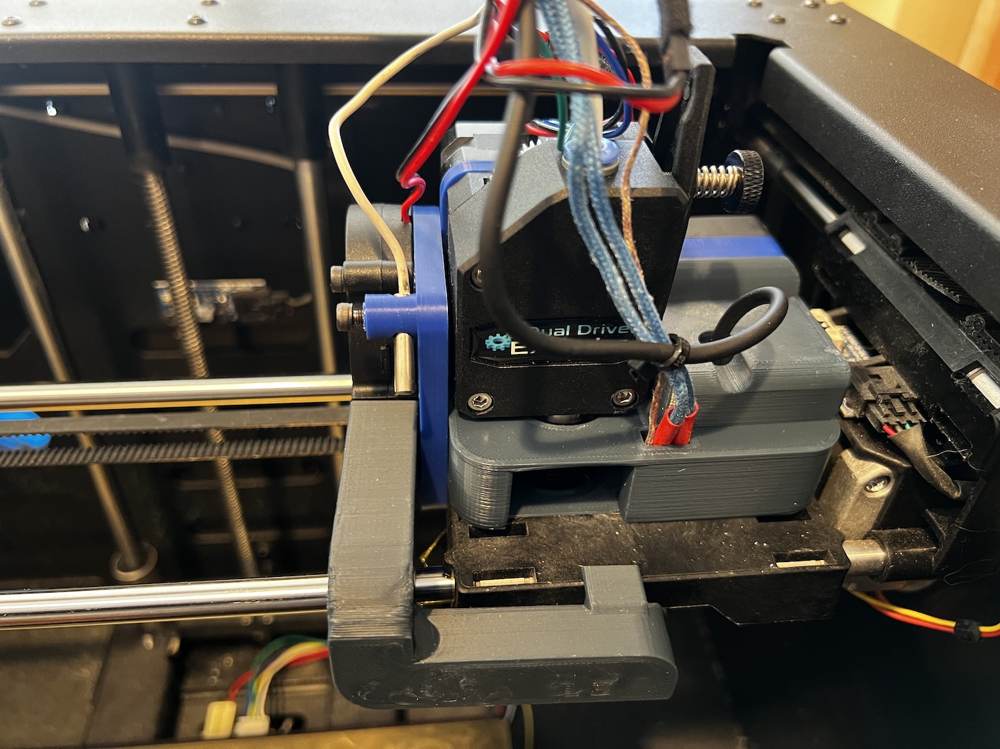

# FlashForge Creator X/Pro/Makerbot Dual Upgrade

Originally [Thingivese:5788139](https://www.thingiverse.com/thing:5788139)

## Overview
I have a 2015 [FlashForge Creator X](https://www.3dbeginners.com/flashforge-creator-x-review/)
which I enclosed and added a part fan for cooling, which brought it up to the "Creator Pro"
specs.  However, I decided I wanted to do further upgrades:

 1. Switch from the now deprecated/unsupported [Sailfish firmware](https://www.thingiverse.com/thing:32084)
    to [Klipper](https://www.klipper3d.org).
 1. Replace the MK10 extruder/hotend with something more modern.
 1. Add a [Nevermore](https://github.com/nevermore3d/Nevermore_Micro) carbon filter
    to deal with the VOCs from printing ABS.
 1. Add a chamber heater (TODO)
 1. Add a bed leveling SuperPINDA probe to allow for [bed mesh leveling](https://www.klipper3d.org/Bed_Mesh.html)
 1. Add support for an ADXL345 for [Resonance Tuning](https://www.klipper3d.org/Measuring_Resonances.html)

I couldn't find any existing projects/hacks to upgrade the extruder/hotend so I
decided to create my own.  I settled on the [Phaetus Dragon](https://www.phaetus.com/dragon-st/)
for the hotend and [Bondtech BMG](https://www.bondtech.se/product/bmg-extruder/)
since I had both sitting in a bin looking for a home.   A 
[SuperPINDA probe](https://www.prusa3d.com/product/superpinda/) is easily supported
in Klipper and can use one of the open endstop connectors on the 
[Mightyboard](
https://github.com/sciguy14/HelioWatcher/blob/master/HelioWatcher%20Circuit/MakerBot%20MightyBoard%20REVE%20Schematic.pdf).

Note that the Dragon hotend can be swapped for an E3D V6 or Revo Six as they are the same format.

Of course, fitting all these upgrades meant that I had to give up the 2nd extruder,
but that was often so painful getting the two hotends perfectly level that I
rarely ever used that feature.

The final design looks like this:

### Profile View

### Front View

### Installed

## Printing Parts

Each of the parts needs to be printed in ABS or ASA.  Do not use PLA or PETG
as they can not deal with the hot temps!

You will need to print:

 * [Top.stl](Top.stl) -- requires supports
 * [Base.stl](Base.stl)
 * [Rear.stl](Rear.stl)
 * [WireManagement.stl](WireManagement.stl) -- optional part
 * [FanMount-3mmTempSensor.stl](FanMount-3mmTempSensor.stl) or [FanMount-4mmTempSensor.stl](FanMount-4mmTempSensor.stl) -- depends
    on the diameter of the chamber temp sensor.
 * [FFCP-MonoDuct_v3_x1.stl](FFCP-MonoDuct_v3_x1.stl) -- which I took from [here](https://github.com/DrLex0/print3D-ffcp-left-cooling-duct)

### Recommended settings

 * Layer height: 0.2mm
 * Extrusion width: 0.4mm, forced
 * Infill pecentage: 40%
 * Infill type: grid, gyroid, honeycomb, triangle, or cubic
 * Solid top/bottom layers: 5
 * Wall count: 4

Each of the parts should be printed as loaded.  The only part that requires
supports is the Top.

## Required Parts

 * M3x5mm heat set inserts and a soldering iron to install them
 * M3 SHCS bolts of various lengths 8, 12, 20 and 40mm
 * Bondtech BMG (or clone) extruder with the door on the right side
 * Phaetus/Triangle Labs Dragon or E3D V6/Revo Six hotend
 * 3x15mm thermocouple for the hotend
 * 5015 24V blower
 * 4010 24V fan (can steal one from your MK10 extruder!)
 * NEMA17 1A stepper with max 23mm body length (StepperOnline 17HE08-1004S or equivalent)
 * 24V 40W heater
 * Appropriate wires and connectors
 * Some "Crazy Glue" aka Cyanoacrylate
 * Gold foil insulation tape

## Optional Parts

 * SuperPINDA Probe
    * M8x1.0 tap
 * An additional 3x15mm thermocouple for chamber temp sensor to connect to
    klipper or use something like a HC520 temp/humidity sensor (available from
    Amazon, Walmart, etc) which has a 4mm sensor.
 * ADXL345 with 3mm holes spaced 15mm apart.  I just got a generic board from Amazon.
    * 3mm plastic washers for mounting

## Assembly

### Required Steps

 1. Install 2 heatset inserts into the bottom of the Top part
 1. Install 3 heatset inserts [into the back](pics/heatsets_rear.jpg)
    of the Top part
 1. Install 2 heatset inserts into the rear of the Rear part for
    the fan.
 1. Install 4 heatset inserts [into the holes](pics/heatsets_blower.jpg)
    in the Fan Mount
 1. Apply gold foil tape to the Base to protect the bottom from the heat of the
    hotend.
 1. If you are using the SuperPINDA probe and do not have a M8x1.0 tap, 
    now is a good time to install that into the base.
 1. Using 2 M3-8mm bolts as a guide and help with compression, align the
    Base and Top parts.  Then use cyanoacrylate glue to glue them together. Set 
    aside and let glue fully dry.
 1. Once glue is dry, install the two heatset inserts 
    [into the side](pics/heatsets_side.jpg) of the assembly.
 1. Use 3 M3-8mm bolts to attach the rear and glued assembly.
 1. Insert the Dragon hotend through the bottom of the assembly and attach the
    Bondtech BMG extruder.  Be sure to use the appropriate length of PTFE tubing
    between the hotend and extruder!  Rotate the extruder so the label is
    facing the front of the assembly.
 1.  Using 3 M3-40mm bolts, attach the NEMA17 stepper to the assembly &
    extruder.  Ensure the wires are facing up!
 1. Using 2 M3-12mm bolts, attach the 4010 fan to the assembly.
 1. Using 2 M3-12mm bolts, attach the assembly to your X carriage.
 1. Using 2 M3-8mm bolts, attach the fan mount to the assembly
 1. Using 2 M3-20mm bolts, attach the 5015 blower to the fan mount
 1. Install the heater and thermocouple in the heater block and route the wires
    through the front hole
 1. Using 1 M3-8mm bolt, attach the linked fan duct (linked provided above) to
    the assembly (recommend to use gold foil tape to protect ducts!)
 1. Verify your stepper does not make contact with the frame when homing Y axis.
 1. Verify the tab on the Rear makes contact with the X axis end stop.
 1. Verify your wiring and recalibrate your printer!
 
Note that the stock extruder steppers are rated for 1.3A but the shorter stepper
is rated for 1A.  You should verify the stepper driver current to ensure it
doesn't over heat.

### Optional Steps

#### SuperPINDA
 1. If installing the SuperPINDA probe, use a M8x1.0 tap to clean up the printed
    threads.  Note that this is M8x1.0 and not the more common M8x1.25!
 1. Install the SuperPINDA probe (use one lock washer and nut on the bottom).
    [Use an allen key](pics/pinda_probe.jpg) to ensure the probe won't touch the
    bed and set the spacing.  Be sure the probe is not too high, because you
    want to make sure it triggers before the hotend hits the bed!

#### Chamber Temp Sensor
 1. If using a chamber temp sensor, you can use either a standard 3x15mm
    thermocouple like in the hotend or an external monitor like the HC520
    available on Amazon, Walmart, etc which uses a 4mm diameter sensor. Use the
    appropriate fan bracket!

#### ADXL345
 1. If installing the ADXL345, install the 2 additional heatset inserts on 
    the top of the assembly near the fan.
 1. Using some 3mm plastic washers and M3-8mm screws mount the ADXL345 towards
    the rear so as to not interfere with the extruder door.
