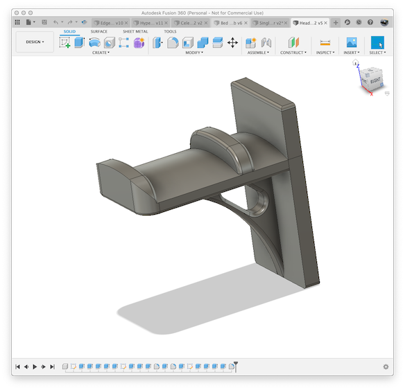
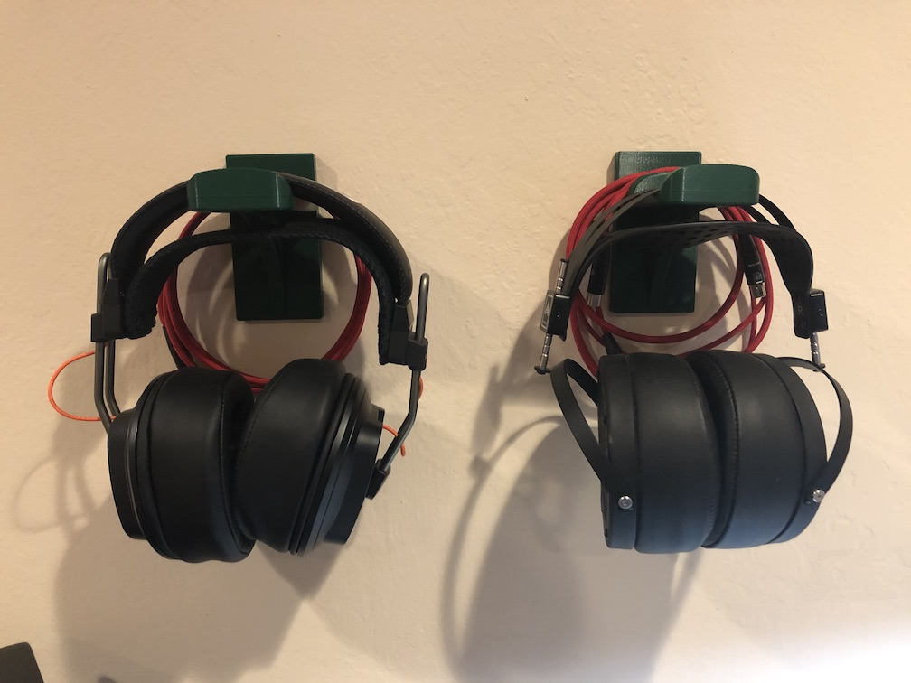
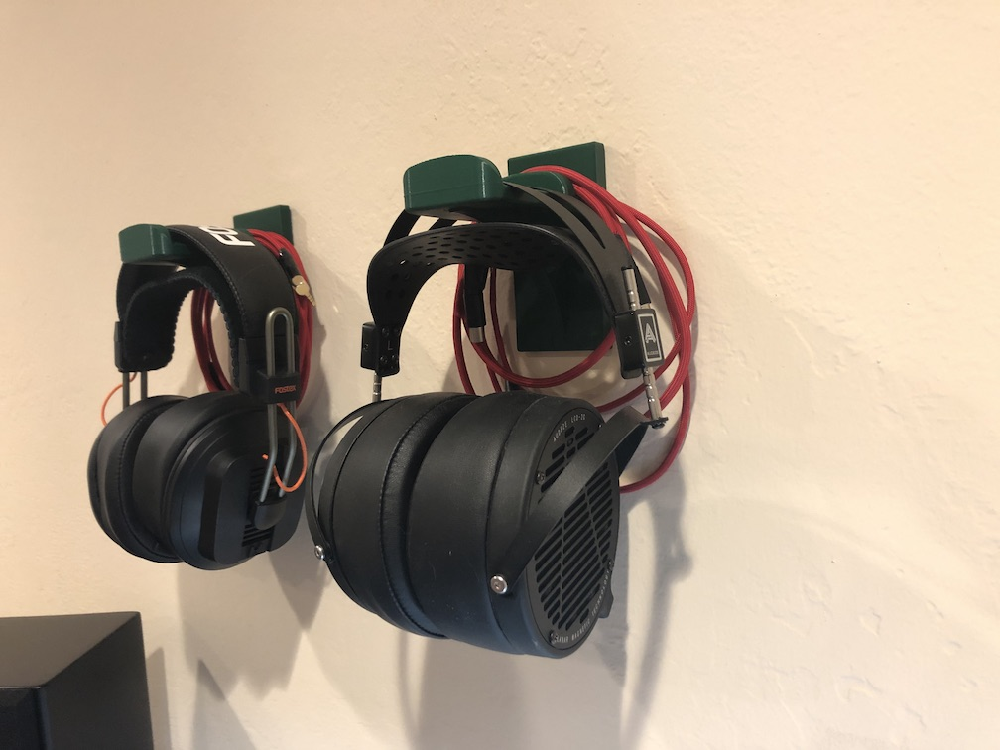

# Headphone Mount

## What

I started getting more into music and trying out different headphones.  Over time,
I've ended up with a small collection of headphones and I didn't want to dedicate
shelf space to store them.  Hence I created this wall mount for headphones.

The design is (mostly) parametric so I was able to create different sizes of mounts
based on the width of the headband.  I include STL files with 40mm to 70mm width.

I'm using this mount with even very large & heavy headphones like my Audeze LCD-2C's
without problems.

## Print Instructions

Print one of each top/bottom parts for the desired headphone headband width (40-70mm).

ABS, PLA, PETG, whatever.  I use 3 top/bottom layers and 3 shells with 35% infil
using eSun PLA+.

## Required

Each mount will require:

* 2x 3M Command Strips size medium or large
* 1x M3 x 12 bolt
* 1x M3 x 5mm wide / 4-6mm deep brass heat insert

## Tips

1. For heavy headphones, be sure to use the "Large" size strips.
1. Install one half of the two Command Strips on the back of the bottom with the 
    tabs visible & facing up
1. Install the other half of the two Command Strips on the wall where you want to
    hang your headphones
1. Use a soldering iron to install the brass heat insert in the hole in the bottom
    of the top
1. Assemble the two pieces and use the M3 bolt to hold the two parts together.
1. Install the headphones on the wall- you should hear the M3 Command Strips "clip"
    together

## Images

Renders:

Front:

Side:

