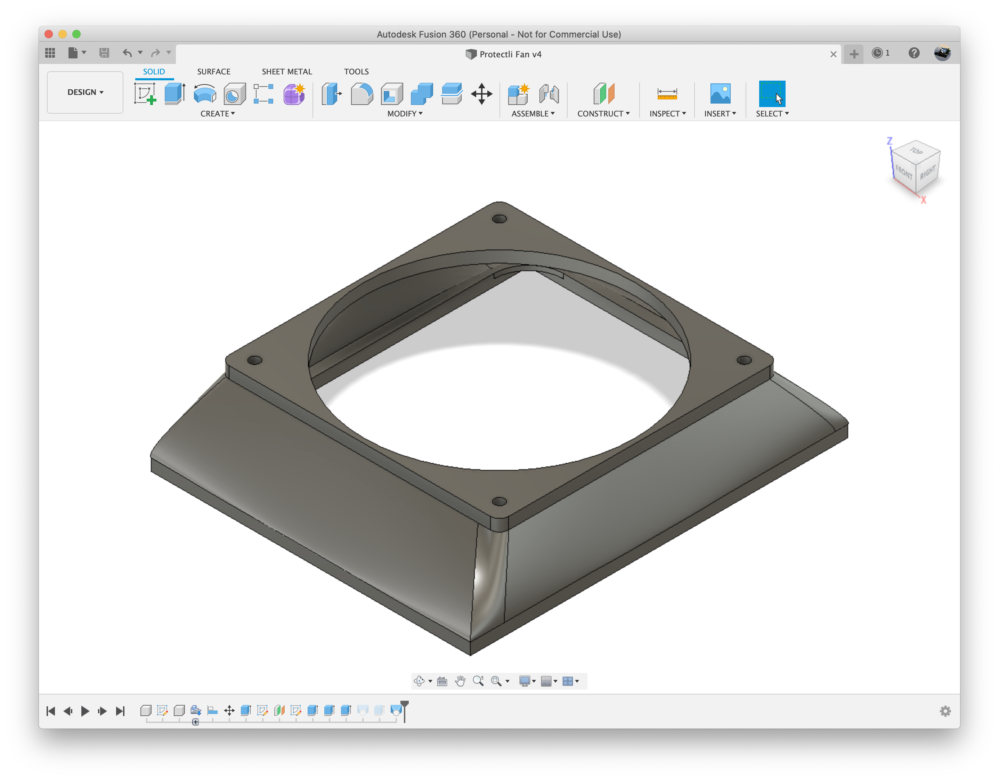
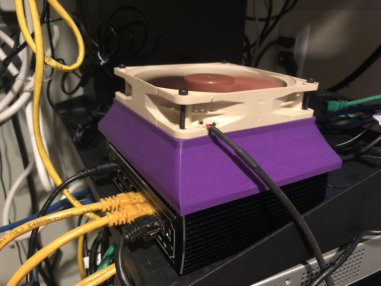

# Protectli 6 Port Vault Fan Shroud

## What 

The Protectli FW6 is a passively cooled server, but I wanted to add a 120mm fan
to control temperatures since I have it installed in my AV/server closet and 
when everything is turned on the ambient temperature can get well over 80F.

## Print Instructions

Printing with supports is recommended.  ABS, PLA, PETG or whatever is fine.

## Required 

This fan shroud uses 4x 4mm long M3 heat inserts.

## Images

