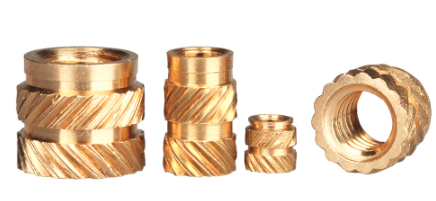

# 3DPrinting

Collection of my 3D Printing designs.

## Why?

Because I want to share my designs and sadly, [Thingiverse](https://www.thingiverse.com/synfinatic/designs)
keeps getting worse.

## What

You'll find STL and [Autodesk Fusion360](https://www.autodesk.com/products/fusion-360/overview)
files for the following projects.  I decided to provide the original F3D/F3Z
files because that really is the "source code" for these projects- not just the
STLs and I wish other people provided those files so I don't need to rely on
tools like [Meshmixer](https://www.meshmixer.com) to make modifications.

### 3D Printing

#### 2020 Extrusion Mounts
* [2020 e-stop mount](3D_Printing/2020EStopMount/) - Mount an e-stop switch to 2020 corner
* [2020 Ethernet Jack](3D_Printing/2020EthernetJack/) - Mount a F2F RJ45 jack to a 2020 extrusion 
* [2020 Rubbermaid Holder](3D_Printing/2020RubbermaidHolder/) - Mount a Rubbermaid 21 cup storage container to a 2020 extrusion 
* [LED Light Strip / 2020 Extrusion Mount](3D_Printing/2020_led_mount) - Mount for 12-24V light on 2020 extrusions
* [Voron2 External Camera Mount](3D_Printing/VoronExternalCameraMount/) - Mount for a camera

#### Misc

* [Spool Holder NG](3D_Printing/spool_holder_ng) - Spool holder for Rubbermaid 21 cup storage containers
* [Bed Level Knob](3D_Printing/bed_level_knob) - Nice knob for M3 screws to easily level your print bed
* [Humidity Mag Bracket](3D_Printing/HumidityMagBracket/) - Magnetic bracket for cheap humidity sensor
* [Single Side Spool Holder](3D_Printing/SSSpoolHolder/) - Supports load cell for weighing the spool (WIP)
* [Spool Saver](3D_Printing/SpoolSaver/) - Clamp used to add friction to a spool

#### Makerbot 2X / Flashforge Creator X parts

* [Dragon/Bondtech BMG/Pinda Probe mount](3D_Printing/FlashforgeCreatorDragon) - radically better hotend/extruder and bed mesh level support!
* [Bowden Tube Extruder Mount](3D_Printing/ffcx_bowden_mount) - Improved bowden tube mount for Makerbot 2X/Flashforge Creator X (Pro)
* [Dual V6 Mount](3DPrinting/FFCXDualV6) - Dual V6 hotend mount (bowden)
* [Plexi Enclosure](3DPrinting/FFCXPlexiEnclosure) - Create a plexi-glass enclosure

### Astronomy

* [Boundary Fan Mount](Astronomy/BoundaryFanMount/) - Custom boundary fan for my StarMaster 12.5" ETL
* [Celestron Evolution 8 Foot](Astronomy/CelestronEvo8Foot/) - Mount for aftermarket feet for the Celestron Evolution 8 mount
* [Celestron USB Handcontroller Cable Holder](Astronomy/CelestronUSBCableManagement/) - Keep your USB cable from falling out
* [Celestron EdgeHD 800 Fastar Cooler](Astronomy/EdgeHD800Cooler/) - Cool down your EdgeHD 800 OTA faster
* [Celestron EdgeHD 800 Hyperstar Cable Router](Astronomy/EdgeHD800HyperstarCableRouter/) - Avoid spikes in your images with a Hyperstar
* [Moonlight Slide Adapter](Astronomy/MoonlightSlideAdapter/) - Custom mount for the Moonlight Slide to my UTA on the SM 12.5 ETL
* [PST Sun Shade](Astronomy/PSTSunShade/) - Coronado Personl Solar Scope Sun Shade
* [PST to Evolutiono Mount](Astronomy/PSTtoEvolutionMount/) - Dovetail to mount a PST to Celestron Evolution mount

### Audio

* [Headphone Mount](Audio/HeadphoneMount/) - Multi-size headphone mount for walls
* [XDuoo TA-20 Spacer](Audio/XDuooTA20Spacer/) - Spacer to raise the covers when using a socket saver

### Enclosures

* [LM2596 Mount](Enclosures/LM2596Mount/) - Mount for a LM2596 board
* [PWM Controller](Enclosure/PWMController) - Case for a cheap PWM controller
* [Rasperry Pi 3 + Relay](Enclosures/RasPi3Relay/) - Case for a RasPi3 + Relay Board
* [Protectli FW6 Fan Shroud](Enclosures/Protectli-FW6/) - Fan shroud for [Protectli FW6](https://protectli.com/vault-6-port/) series.

### Misc

* [Center Speaker Blocks](Misc/CenterSpeakerBlocks/) - Covers for the Monoprice center speaker mount
* [Clamptite Handle](Misc/ClamptiteHandle/) - Handle for a Clamptite
* [KitchenAid Mazer Mini](Misc/KitchenAidMazerMini/) - Adapters to install Mazer Mini Burrs in a KitchenAid Pro Grinder
* [KitchenAid Spindle](Misc/KitchenAidSpindle/) - Redesigned KitchenAid Pro 
* [Parralenz Cap](Misc/ParralenzCap/) - Lens cap for the Parralenz dive camera 
* [Xacto Cover](Misc/XactoCover/) - Safety cover for Xacto knives

### Motorcycle

* [Ducati 1098 Gas Tank Bracket](Motorcycle/Ducati1098GastankBracket/) - Bracket for gas tanks that have expanded due to ethanol
* [Duzucati Airbox](Motorcycle/DuzucatiAirbox/) - First Gen Duzucati Airbox bracket
* [Duzucati Airbox NG](Motorcycle/DuzucatiAirboxNG/) - Second Gen Duzucati Airbox bracket
* [Duzucati Radiator Bracket](Motorcycle/DuzucatiRadiatorBracket/) - Duzucati Radiator Bracket for 2ndGen SV radiator
* [Duzucati Speedo Bracket](Motorcycle/DuzucatiSpeedo/) - Custom speedo bracket
* [GoPro Mount Cover](Motorcycle/GoProMountCover/) - Custom cover to protect GoPro cameras
* [Ohlins Fork Potentiometer Mount](Motorcycle/OhlinsForkPotentiometer/) - 56mm upper mount
* [Ohlins TTX Shock Potentiometer Mount](Motorcycle/OhlinsTTXPotentiometer/) - Upper and lower mount for Ducati 848/1098 Ohlins TTX shocks

## General Notes

### Heat Inserts

Many of my designs utilize brass heat inserts for interfacing with bolts as they
simplify the design and provide a high quality connection which resists stripping.
I highly suggest using high quality brass heat inserts designed to resist both
twisting and pulling out like this:

Sadly, it is very hard to find distributors in the USA who carry these inserts,
but [you can find them on AliExpress](https://www.aliexpress.com/item/4001258499799.html).

## License

Once again I am being consistently inconsistent with choosing a license for my
projects.  For this project I have decided on the [GPLv2](LICENSE).  If you have
a need to use these files and don't feel like this license meets your needs,
please reach out to me and I'm happy to discuss.

## Pull Requests / Modifications

Have you made an edit to one of my projects that you'd like to chare?  Please issue
a pull request and _add_ your files to the project and update the README with details.
