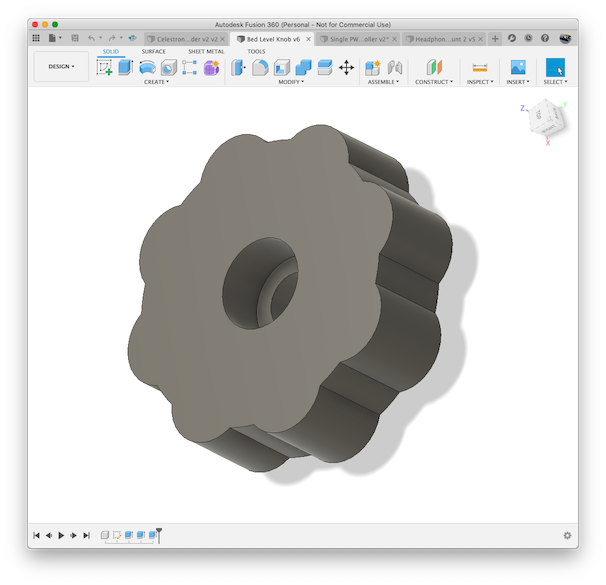

# Bed Level Knob

## What 

A simple knob for adjusting the bed leveling on your 3D printer.  This
design is for M3 bolts.

A lot of printers come with really small and hard to turn knobs.  This
knob is larger and hence easier to turn (especially fine tune).  I
use a high quality heat insert to avoid stripping the threads.

## Print Instructions

You should be able to print a typical 3 top/bottom layers and 3 shells @ 35% infill.

## Required

* 1x M3 x 6mm wide / 6mm tall brass insert for each knob

## Tips

1. Consider using a smaller [M3 knurled knob](https://www.amazon.com/dp/B01HSTVMT8/ref=dp_prsubs_1)
    to be a "lock" to prevent the knob from turning on it's own.

## Images

