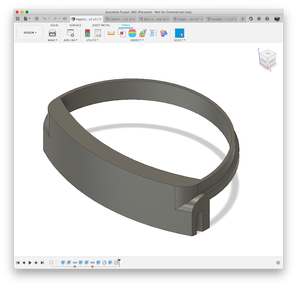
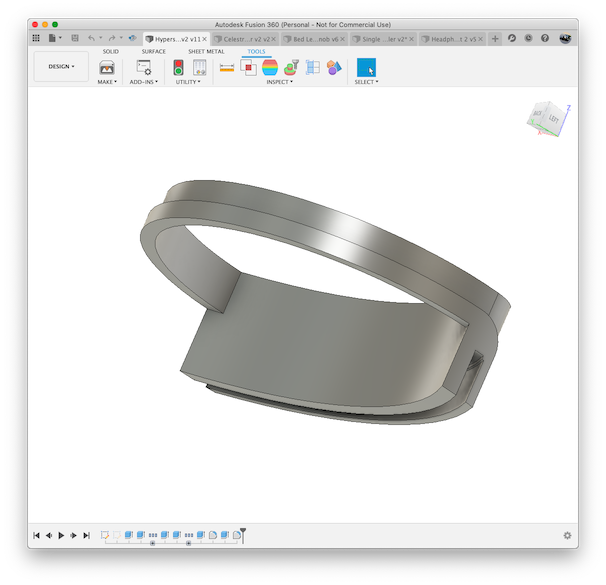

# Celestron EdgeHD 800 Hyperstar Cable Router

## What

If you are using a Starizona Hyperstar for your EdgeHD 800 scope
you need a way of routing the power and USB cables in front of 
the OTA.  Since straight lines cause spikes, I designed this
bracket to route the cables in a 180deg arc to eliminate the spike.

## Print Instructions

This is a part which IMHO ideally is printed in PETG due to its
natural strong layer adhesion and flexibility which reduces the 
likelihood of cracking when flexed.  Also, unlike PLA, PETG is more 
heat/sun resistant.

## Tips

Just print the part and place your power and/or USB cable in the slot.
You can use electrical tape or contact cement to hold the wires in place.

## Images

