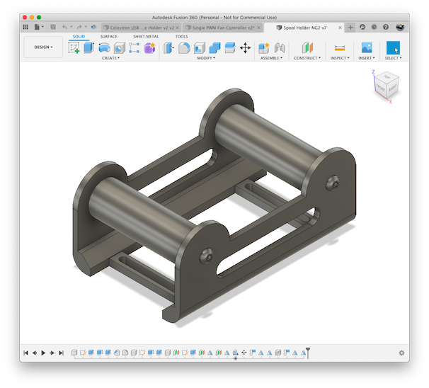
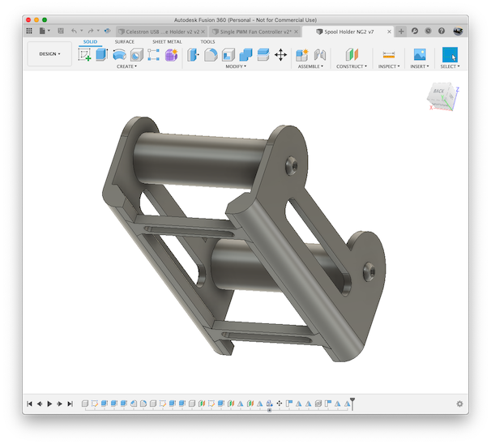
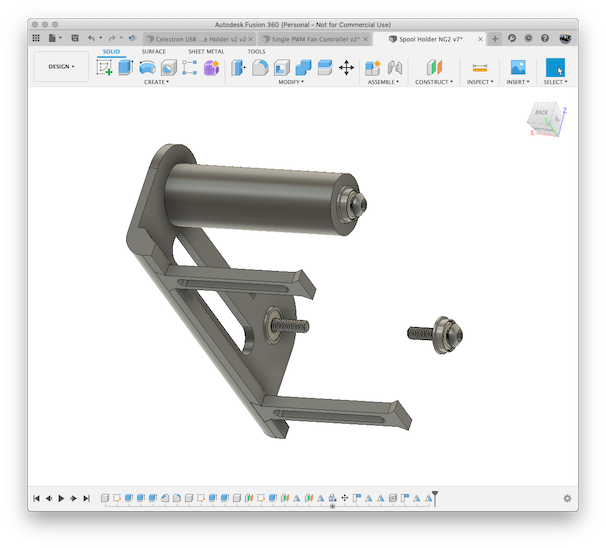

# Spool Holder NG

## What

A really nice 3D printing filament spool holder for the newer style [Rubbermaid 
21 cup storage container (1776473)](https://www.amazon.com/Rubbermaid-1776473-Racer-Storage-Containers/dp/B07QWDTZB6/)
which is often used as a drybox.

Basically, this is designed to be very sturdy, allow a maximum variety of 
spools (max width of 78mm) while being easy to print and smooth rolling.

## Print Instructions

You will need to print two of each part (side, brace and roller) per spool holder.

ABS, PLA, PETG, whatever.  I used 3 top/bottom layers and 3 shells with 35% infil
using eSun ABS+.

## Required

Each spool holdre will require:

* 4x F695 bearings
* 4x M5 x 25mm button head bolts

**Warning:** Not using button head bolts will likely cause the bolts to rub against
the side of the container and cause the roller to drag and not move smoothly.

## Tips

1. Throw in some desicant and a humidity sensor to ensure your filament stays dry.
1. Assemble the spool holder and tighten the four bolts just so they start to compress
things and drag.  Then loosen each bolt 1/4 turn and confirm with a full spool of
filament that it rolls smoothly.

## Images

